# Big data project
### Giới thiệu bài toán
- Bài toán: Crawl dữ liệu thời gian thực từ 1 api giá vàng và phân tích, đánh giá, dự đoán về giá mua, bán.​
- Bài toán được thực hiện trên cụm 3 máy ảo
- Luồng dữ liệu: Crawl data từ api giá vàng về máy sử dụng kafka. Sau đó lưu dữ liệu vào trong HDFS. Spark lấy dữ liệu từ HDFS, dùng SparkML để dự đoán giá mua và bán đồng thời sử dụng SparkSQL để kiểm tra một số thuộc tính của dữ liệu. Dữ liệu được visualize trên jupyter notebook.​
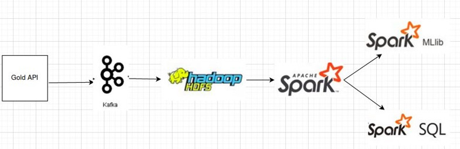

### Dữ liệu
Crawl trực tiếp từ api giá vàng:

https://forex-data-feed.swissquote.com/public-quotes/bboquotes/instrument/XAU/USD

### Kafka​
- Cụm kafka gồm 3 brokers.
- 1 topic tên là Goldrates để crawl data dạng json về máy.

Sau đó chuyển data từ dạng json sang csv.
### Hadoop HDFS
- Gồm 1 máy master và 2 slave.

    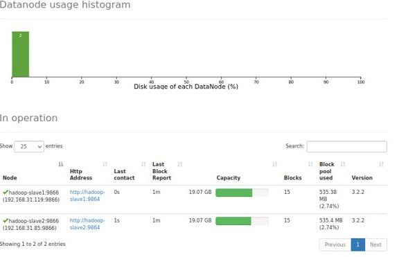
- Lưu trữ các file data đã crawl được như hình dưới:

    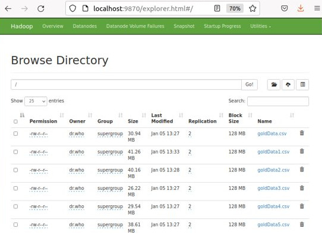

### Spark
- Cụm spark gồm 1 máy master và 2 worker.

    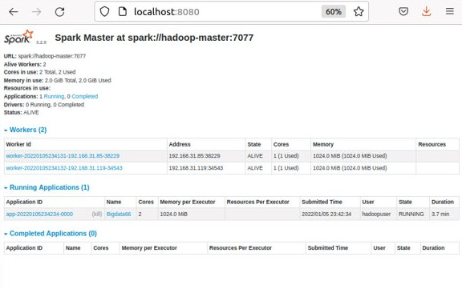

- Khởi động jupyter notebook, tạo 1 job tên là Bigdata66 lấy dữ liệu từ hdfs.

    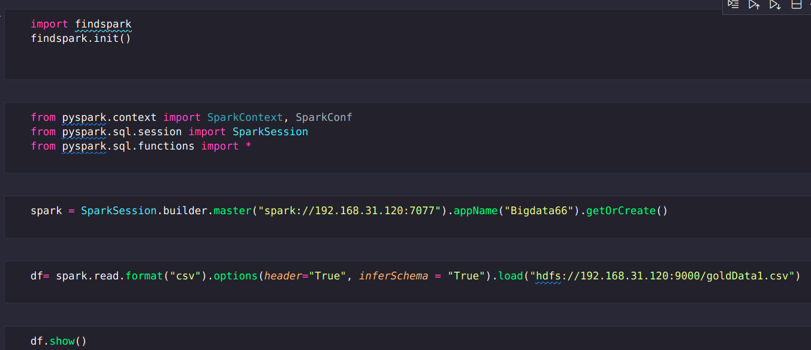

### Spark ML
- Vecto hóa dữ liệu:​

    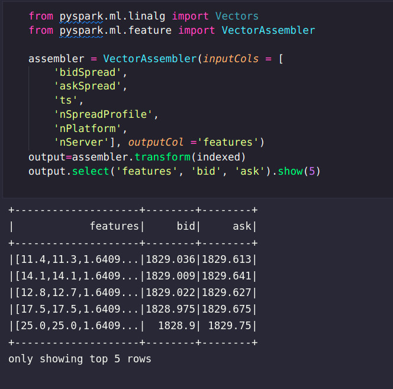

- Chia dữ liệu thành 2 tập:

    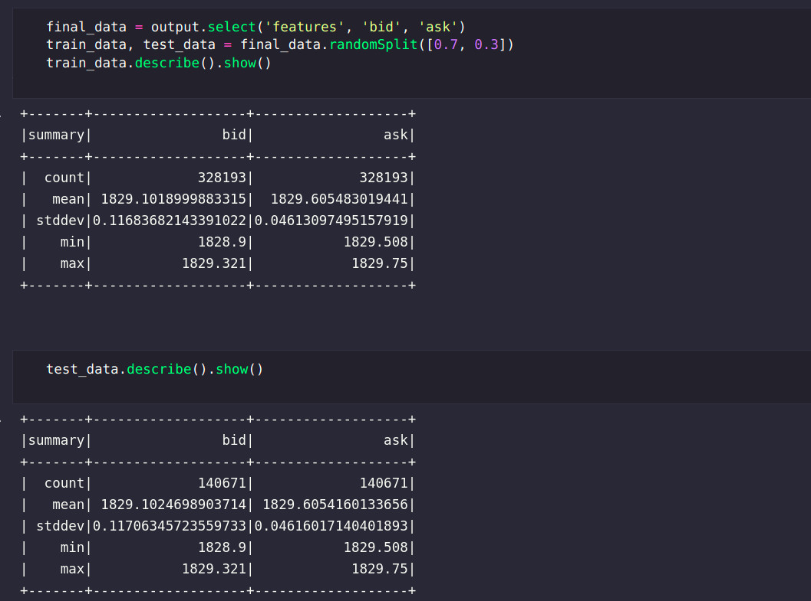

- Sử dụng Linear Regression để dự đoán bid và ask​:

    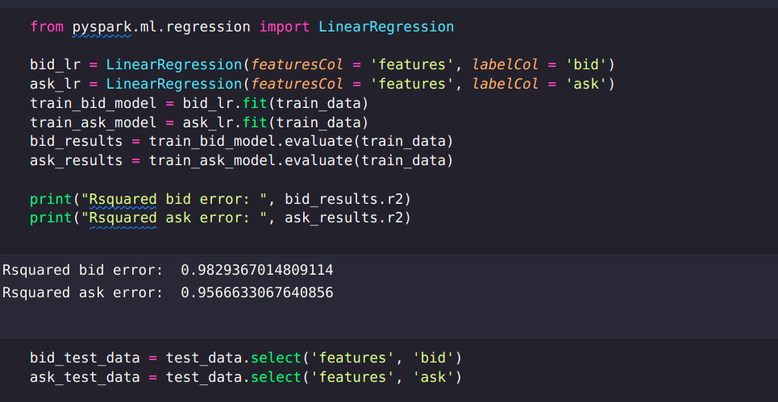

- Kết qủa dự đoán:

    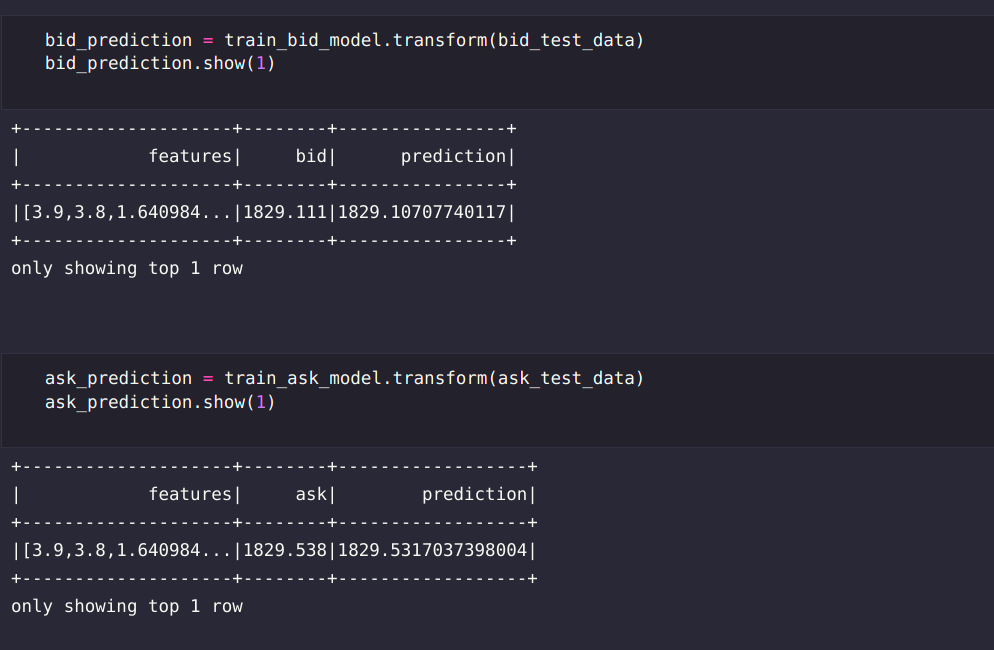

### Spark SQL
- Tạo TempView goldPrice:
    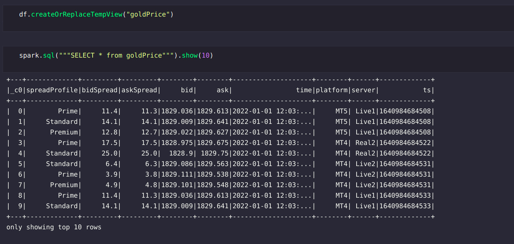
- Kiểm tra 1 vài thuộc tính của dữ liệu:
    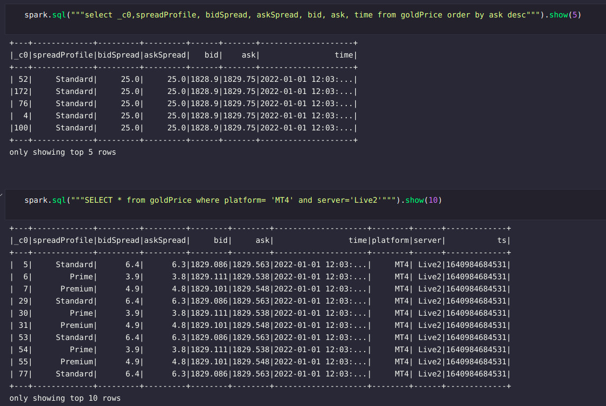

